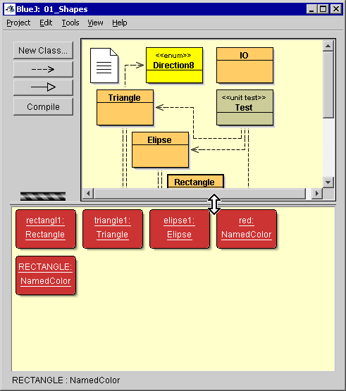
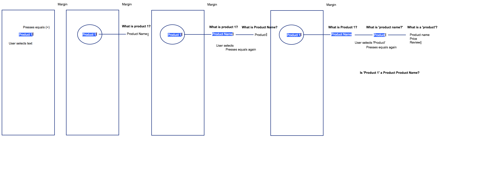
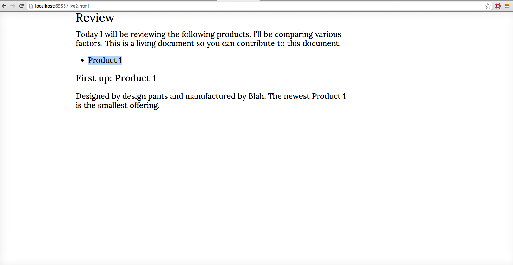
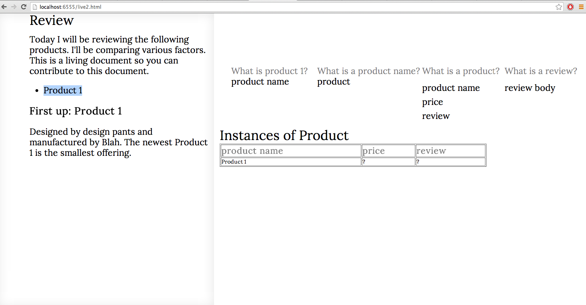
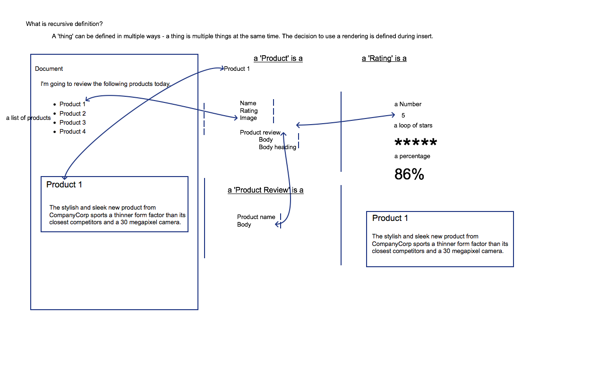
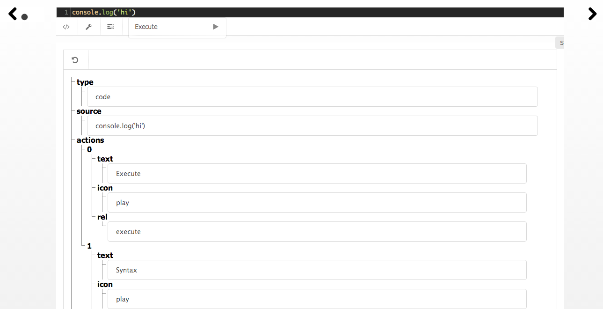
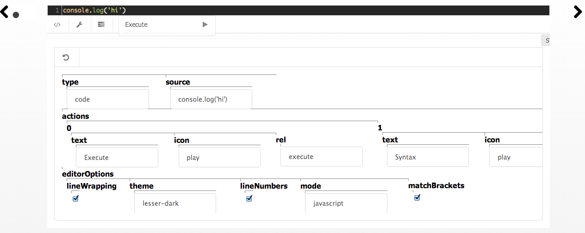

# Living Documents Re-explained

What the hell is a living document and why is Sam so obsessed with them? I have poorly explained LD in the past - thanks for being patient! Technically a living document is not complicated - it just attempts to make existing tools useable together by combining a set of user interactions and conventions.

## Editing, Viewing: Direct manipulation

In typical blogging, forums and wiki applications, there is a distinction between 'editing' and 'viewing' because separate interfaces are employed. This typically involves some kind of input area that accepts a particular markup and determines how the document looks. This implies the following which I consider problems and for LD to address:

 - you can typically only insert data in one format, such as markdown, HTML or Mediawiki syntax.
 - if there is no live preview and you want to see your document, you have to explicitly save or preview it
 - you are unnecessarily restricted by your browser editor; you cannot insert everything that the browser could potentially render.
 - you cannot reuse things
 - if you paste something that the application does not understand or know how to display properly, it might be rendered poorly

A living document eschews the boundaries between 'editing' and 'viewing' and opts to allow the user to manipulate what is on the screen directly. In this sense, a document is more like an actual application in the sense the user can manipulate the things that they type. This is similar to WYSIWYG but with components.

What does it mean that 'a document is like an application'? When I say application, I mean in the sense that there might be menus, icons and the ability to interact with elements on the screen that can be separately controlled as if they were objects in a graphics editor. Some examples:

 * user inserts a table. The user can transpose the table, add rows and move data around easily
 * user inserts a graph and can adjust the scale, directly edit the title or change the unit

Examples of direct manipulation are things like Bret Victor's 'Learnable Programming' (http://worrydream.com/LearnableProgramming/)

Another example is BlueJ - an educational programming environment where created objects can be interacted with.



## Living documents function as programs

I find it frustrating how poorly GUI tools compose together. You end up having to export from one application and manually moving content (pasting) or uploading files between systems. Even the traditional systems that are explicitly designed for maintaining content like content management systems and document management systems are rigid and inflexible. Composing different kinds of content using GUI manipulation is frequently repetitive and inefficient compared to the terminal.

User interfaces are less powerful than text driven systems but this is not necessarily a given. Attempts to close the gap exist through drag-and-drop interfaces, visual flow programming languages and purpose built interfaces. A living document is not meant to be a fully graphical replacement for programming languages and editors but is meant to allow the ecosystem of GUI manipulation, terminals and programming languages to work together seamlessly. LD is meant to empower developers as well as regular users. The LD approach is to make creating a purpose built interface feel like writing a document that would normally be updated manually.

In MVC architecture, code that manipulates data is separated from the code that displays it. Typically this is a programmer concern but can actually be useful for a user too. The same piece of data can be viewed in multiple ways.

 * documents can be edited in an outline format
 * dataflow and tabular/spreadsheet data can be visualized as a graph
 * a table, a tree
 * a progress bar, an accordion, tabs, treelist, galleries, lightboxes

In this way, a living document is 'like a program' in three senses.

 * **There are types**: Inserted things act like separate types (or functions). A more involved example is the ability to create new distinct thing that has its own set of data. For example, if you were writing a set of reviews for a range of products, it might be sensible to collect the raw data for each review first. The raw data might include a 'link to manufacturer website', 'score' and 'price'. At any point in the article, you might refer to this data for a given product. In the sense of a program, this is an abstract data type. Whenever the data changes, all references to the data also change. This is just like how a variable can be used multiple time in a programming language.
 
  * **Scope**: a document has scope like a programming language does: what has been created or passed in is available to the active document for reuse elsewhere.
 
 * **It has to be applied**, a document is a program because it must be executed. This is because inclusions of data are dynamic - they are expressions that have to be evaluated for the document to make sense. At first glance this appears a disadvantage in common with conventionally implemented static site generators or dynamic blogs and wikis which have an explicit 'generate' or 'save' action to produce output. The difference is that a LD is meant to run continuously, like a program: users are meant to interact, any changes they make are instant. The second part is that documents have formal parameters. That is, any references embedded in a document are in fact arguments to that document. What does this mean? This means that documents are themselves referencable.

## User defined CRUD and recursive definition

The closest approximation to a living document is a spreadsheet. The difference is that LD are not confined to a tabular view and the computation does not have to be hidden behind cells. In a LD, it is the relationships  - which are effectively the same thing as computation - between different on-screen components are visualizable, perhaps as sourcecode and/or as connecting lines overlaying items.

Content in a LD has multiple sources: it is unlike HTML where everything is literal. A piece of content can actually come from elsewhere. Like a templating engine, a LD allows information to be 'named' and separately identified and referenced. A LD goes a step further by allowing 'user defined crud' permitting the structure of information to be expressed and explored as part of the document. This allows users to define:

 * the structure of the data
 * the relationships of that data
 * how the data should be collected
 * how it is displayed

How do you allow users to define data and the relationships of it? LD accomplishes this through 'recursive definition'. This is recursive because whenever you define something as a series of components, you are asked to define those components too. For example, a user creates a list of items, they can then specify what an item is and what it is equivalent to. In a list of items, we can say each item is actually just the name of some other thing but not the thing itself. We have actually created a relationship between the item in the list, the name and the other thing. This is recursive definition.

```
PRODUCT = NAME, PRICE, REVIEW
 a product has a name, price and review
 
REVIEW = BODY
 a review is a body
```

In this example, we have said that Product 1 is a Product Name. With a stretch of the imagination we can also see this as being bidirectional: the product name, "Product 1" is a Product 1.

Recursive definition retains the relationships between items. For example:

 * user types a product name into the list
 * the user says that it is a product name
 * the user says that a product name is a product
 * the user says the product is a price and review

At each level, they are making assertions about the definition of what they have inputted. Ideally, the order should not matter. The user could accomplish the same thing by:

 * user types a product name
 * user says the product name is a product
 * user says a product is a product name, price and a review

```
Product 1
 Product 1 is a PRODUCT
  PRODUCT is a NAME, PRICE
   NAME is a NAME
 
 Product 1
  Product 1 is a PRODUCT NAME
  PRODUCT NAME is a PRODUCT
   PRODUCT is a PRODUCT NAME, PRICE
 
```

By having the user explain the structure of content, the user is inadvertently creating entity relations, data structures and grammars. Having the above definition makes it possible to pull data from deeply nested data structures.

## Recursive Interactions

This is an expected user-interaction:

1. User selects text
1. Presses =
1. A line is drawn from the text into the margin and a heading appears asking 'What is it?'
1. User types what it is
1. User presses enter and repeat.









## Why is it useful?

Why is creating relationships between input useful? This is useful for the following reasons:

 * **Autocompletion** if the user types a symbol such as 'Product 1' again - which matches a product - they can be asked what they want to include from that item. They either mean what they typed or they mean something else related to that product.
 * **Backend Storage** we can store user's data how it might be theoretically implemented if it were hand-written. For example, the JSON tree below is a serialization of a recursive definition .
 
```
{
    "children": [
        {
            "children": [
                {
                    "name": "rating"
                },
                {
                    "name": "product name"
                },
                {
                    "children": [
                        {
                            "name": "review body text"
                        }
                    ],
                    "name": "review"
                }
            ],
            "name": "product"
        }
    ],
    "name": "product name"
}
```

This tree can be processed to create two tables in a database:

 * product
 * review

With each table having the following fields:

 * product:
 	* id, name, rating, review_id
 * review
 	* review_body_text

Natural keys can be determined by findings loops in the tree:

```
 product name -> product -> product name
```

```
(map create-table (find-loops definition))
```

This implies a primary identifier of 'product name' and can be turned into a summary of tables.

```
[
	{"table_name": "product",
	"fields": ["@product name", "review", "rating"]}
]
```

A problem arises when we have 'one to many' relationships. The user could select some text and type 'review' to specify what they have typed is actually a review.

We would do a search for all fields named 'review' and the above product.review would be matched. Since the review field is a scalar - it cannot hold more than one review it must be split and the following created.

```
[
{"table_name": "review", "fields": ["review"]},
{"table_name": "product_reviews", "fields": ["@product", "@review"]}
]
```

# Format/feature detection

A LD is meant to allow recombination and mixing of data sources. For this to be possible, the user needs the ability to deconstruct data and visualizations intuitively. Recursive definitions supports this for user defined data but are not sufficient for all kinds of data that a user might wish to use. The ability to extract data from complex or unstructured data requires other tools and primitives.

In order to extract data from data sources there needs to be the ability to automatically recognise data upon entry. This is accomplished through:

 * **Feature extraction** Allows features from text or data to be recognised and treated separately. Examples include measurements, phone numbers, postal codes and formulas.
 * **Pattern matching** Matching against known patterns such as geographical locations.

Is there anything useful that a LD can do with this information (excluding search)?

 * We can interpret numbers and calculations and show workings. http://fooo.fr/~vjeux/github/soulver.js/soulver.html
 * We can execute an operation that accepts one of these types as input. For example, a person can be emailed.


## Contextual menus and microservices

If we can isolate data types using feature detection, we may be able to determine what kinds of things can be done with it. For example, a phone number in a document can be callable. Since we know the types of various items in a document, we can offer operatons that are useful. This is like a contextual menu in desktop environments, where a right click can bring up a menu of relevant options. This is also like autocompletion popups for spell checkers on touchscreens or the IntelliSense menus used by programmers. For example:

 * File paths, port numbers, IP addresses, hostnames
 * A person's name, a phone number, an address
 * Measurements, units, distances


# The web browser is just a data structure renderer

A web browser can represent many different types of information but rarely do web platforms permit inserting more than a small set of simple formats:

 * restricted HTML
 * images
 * simple formatting
 * hyperlinks
 * headings
 * tables

We can render many different kinds of data in a web browser. There is unfortunately an impedance mismatch between users and the tools used to used to create these visualizations. Fortunately, many visualizations are data driven, for example:

 * an organisational chart
 * a timeline
 * a tree
 * drag and drop interfaces
 * Dot, SVG
 * Graphs
 * Widgets
 * Video, audio and images
 * Animations
 * simulations

If the HTML and Javascript or serverside programs used to create these visualizations accept data in a well defined format, we can allow users to insert these things more readily.

 * constants in a spreadsheet formula should not be constants - they should be special cells

If there is already a widget being displayed, we might want to repurpose parts of it or the data within it. The components of one data structure can be recombined to create new visualizations or behaviour. This could be achived through the following user interactions:

 * **'Deconstruct'** - a user operation that breaks down a component into its component parts.
 * **'Flip around'** - a way to see what a component is composed from behind the scenes
 * **Contextual menu or semantic autocompletion** Which permits operating on an item or searching for another item to use with it.
 * **For touchscreens: Flick selection** Where objects are flicked toward to a side of the screen which acts as a holding area for potential operations.
 * **Recursive definition**

# Reconstruction

If a visualization is just another view of data, how can we allow users to build them comfortably?

A system admin might want to compose some data from the terminal, they could run:

```
lsof | ldoc
```
This would output a complex table into an LD. This table could then be:

 * treated like a spreadsheet
 * linked
 * aggregated by column
 * converted to cards


# Searches are portals

If I search for something, it might be that this query represents something useful and something more long term than just a search result screen.

 * a user may wish to define an address book as all phone numbers that appear in any living document.

## Draw widget

Draw widget is the idea that there can be a relationship to a drawing to some piece of data. This can make programmatic construction of widgets possible.

 * this can be combined with positioning hints - where things should be anchored towards

# User Interactions

A LD comes with a set of interactive primitives.

## Rotation

The ability to change the orientation of a widget. For example, this shows a tree widget:


That can then be rotated using the rotate button to make the tree horizontal.

This should also be possible using a rotation finger gesture.
 
 
## Decompose/Deconstruction

See what arguments created a widget.

## Swipe to change visualization

The ability to change how something looks like swiping.

 * **Transpose document** Documents can be read left-right or top-down. 
 * **Multifile** See many elements at once.
 * **Shopping** Users should be able to go shopping for data, visualizations and inclusions.


# Parallel interface

Parallel interfaces are alternative user interfaces for the same data. A change within one interface causes a change in the underlying data which is reflected in the others.

## Analogies

 * wiki API with parameters
 * glue
 * DOM elements with APIs
 * viewmodel editor/debugger
 * general purpose management system
 * spreadsheet for widgets
 * hypertext spreadsheet
 * visual pipeline
 * automatic CRUD interface generator
 * integration framework
 * personal bus

# Data sources

 * email
 * web traffic (including SSL)

# Recursive spreadsheets

For data integration: you press equals on a field.
If types don't match, you 'zoom into' the fields and make them match.

# Declarative data and ops

I have files on my desktop
On my phone
On my laptop
On my other laptop
On my work laptop

How do I synchronize:

 1. Files
 1. settings
 1. Software installations
 
 
# Dynamic structure

The software and the user might not know the structure of data in advance. They need to view the data and then add meaning to it. Perhaps by highlighting regions they're interested in.

# Hierarchy Swap UI Updating

# Snippet library

 * User types a small bit of code or some content into the command line
 * The content gets detected and created as a new item in the grid.
 * Pressing = in the command line allows operating on a snippet in some way. This is like excel
 * Click a snippet and it gets added to the autocomplete search.
 * Can search for an operation to run against the snippet.

# Constraint programming / Excel coordinate / Positioning

# Nested spreadsheets

The ability to nest or connect spreadsheets within cells and zoom between them.

# HTML link relationships = a data structure in itself

 * spider the hyper links!
 * the diff(friendA, friendB) = updates

# Command Line Pipeline = Monads

running a WEB REQUEST
extracting data from that request
doing something that data

= a series of monadic transformations

